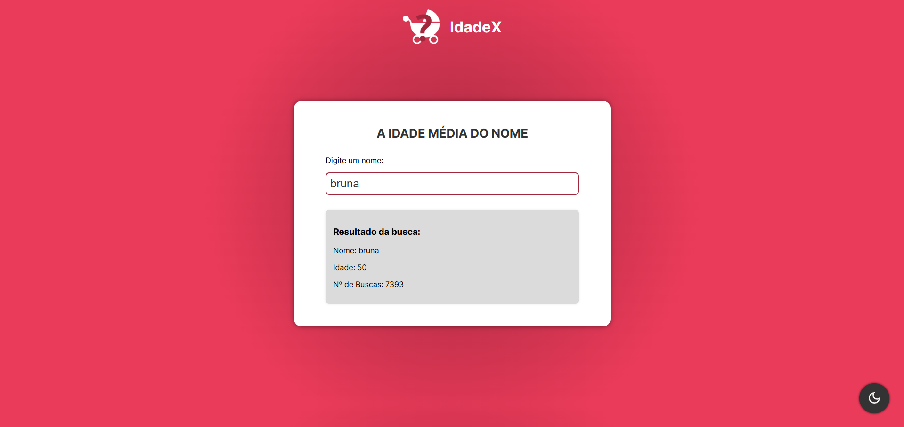

# IdadeX

IdadeX é uma aplicação web que estima a idade média de pessoas com um determinado nome, usando uma API pública. O projeto foi desenvolvido com **SvelteKit**, possui suporte a **modo escuro** e utiliza **debounce** para otimizar buscas.

---

## 🚀 Demonstração



---

## ✨ Funcionalidades

- 🔍 Busca automática por nome com debounce (evita chamadas excessivas à API)
- 🌙 Alternância entre modo claro e escuro
- ⚡ Interface responsiva e moderna
- 📊 Exibe nome, idade média e número de registros

---

## 🛠️ Tecnologias utilizadas

- [SvelteKit](https://kit.svelte.dev/)
- [JavaScript](https://developer.mozilla.org/pt-BR/docs/Web/JavaScript)
- API: [agify.io](https://agify.io/)

---

## 📦 Instalação

```bash
# Clone o repositório
git clone https://github.com/bruna-anunciacao/idadex.git
cd idadex

# Instale as dependências
npm install

# Inicie o servidor de desenvolvimento
npm run dev
